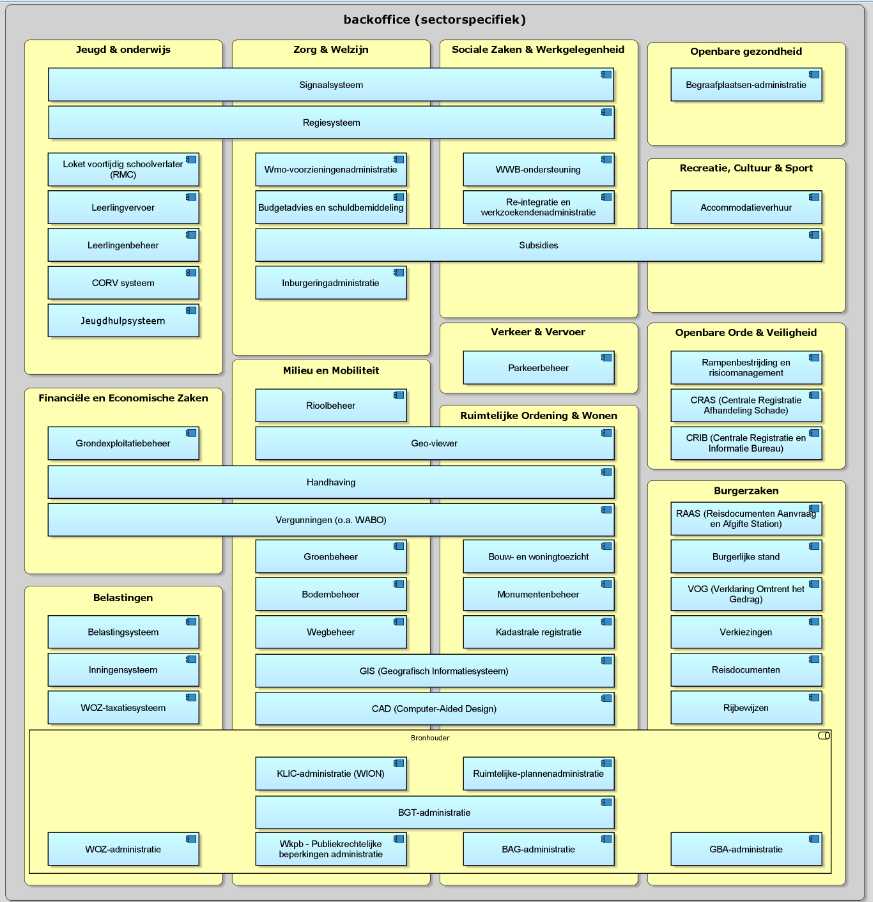

# Hoofdstuk 1 Inleiding 
Dit hoofdstuk geeft een inleiding op het StUF-Geo BAG berichtenverkeer. 

## 1.1 Waarom dit koppelvlak? 
Voor het automatisch uitwisselen van gegevens tussen twee afdelingen binnen de organisatie zijn afspraken nodig welke worden vastgelegd in een koppelvlak-specificatie. Een koppelvlak is een interface die volgens een bepaalde standaard de uitwisseling van gegevens tussen informatiesystemen verzorgt. Een koppelvlak werkt met standaarden. Het aanleverende systeem is verantwoordelijk voor de vertaling van gegevens naar die standaard en het afnemende systeem zorgt voor omzetting naar haar eigen ‘taal’. 

Dit koppelvlak beschrijft de gegevensuitwisseling tussen het registratiesysteem BAG en het registratiesysteem Geo binnen een gemeente. In het registratiesysteem BAG worden gebouw- en adresgegevens bijgehouden in het kader van de wet Basisregistraties Adressen en Gebouwen (BAG). In het registratiesysteem Geo worden de geometrie en attribuutgegevens van topografische objecten bijgehouden in het kader van de Basisregistratie Grootschalige Topografie (BGT) en ten behoeve van intern gebruik (o.a. beheer openbare ruimte). Voor het registratiesysteem Geo wordt ook geometrie van objecten in het registratiesysteem BAG ingewonnen en bijgehouden. 

Om er voor te zorgen dat de registratiesystemen BAG en Geo, en de basisregistraties BAG en BGT onderling consistent zijn, is een koppeling op basis van een standaard van groot belang. Het werkingsgebied van dit koppelvlak is dan ook primair bedoeld voor optimalisatie van gegevensuitwisseling en het beheer van twee wettelijke backoffice processen voor BAG en BGT. Als aanvulling hierop zijn voor aansluiting bij de bredere gemeentelijke behoefte optionele objecttypen uit RSGB toegevoegd, zodat de inwinning van de geometrie van deze objecttypen meegenomen kunnen worden in de bijhouding van de BAG en BGT objecttypen. 

De voordelen van deze koppelvlakstandaard zijn o.a. dat 
* in een specifiek applicatielandschap verschillende BAG-applicaties met verschillende BGT-applicaties kunnen koppelen (via een gegevensdistributiecomponent). 
* een geautomatiseerde koppeling voorkomt, ook op de plaats waar het maar door één persoon wordt uitgevoerd, overtikwerk en fouten in de administratie. 
* het de onderlinge consistentie en de kwaliteit van de gegevens in de twee administraties vergroot wat tot betere informatievoorziening bij besluiten en fraudedetectie leidt. 
* het zorgt voor een helder inzicht in de werkvoorraad aan beide zijden en de stroomlijning van de processen: zaken kunnen niet meer onzichtbaar lang blijven liggen; geometrie wordt niet vaker dan noodzakelijk ingemeten. 

## 1.2 Leeswijzer 
Dit document beschrijft het berichtenverkeer tussen het registratiesysteem BAG en het registratiesysteem Geo (hierna respectievelijk BAG en Geo). Deze koppelvlakspecificatie beschrijft de uitwisseling van geometrie voor BAG-objecten, waarbij BAG de partij is die een verzoek doet om geometrie en Geo de partij is die geometrie levert. BAG houdt Geo verder op de hoogte van wijzigingen (o.a. status en attribuutgegevens) op de BAG-objecten via notificaties (BAG-kennisgevingen) (zie Figuur 1). 

*Figuur 1.1 Schematische weergave componenten StUF-Geo BAG berichtenverkeer.* 

De standaard van berichten waarmee de gegevens tussen BAG en Geo worden uitgewisseld is gebaseerd op het Standaard Uitwiselings Formaat (StUF). Naast bestaande berichten uit StUF 03.10 en de BAG-berichtencatalogus (als onderdeel van StUF-BG) worden voor dit koppelvlak specifieke berichten toepast, aangeduid met StUF-Geo BAG berichten. Dit koppelvlak is als apart sectormodel (geoBAG) gepositioneerd binnen de BAG berichtencatalogus. 

De structuur van dit document is als volgt: o.b.v. een aantal uitgangspunten o.a. verantwoordelijkheden en taken in Hoofdstuk 2 worden een drietal algemene scenario’s van de werkprocessen tussen BAG en Geo geschetst in Hoofdstuk 3. In deze scenario’s worden bepaalde berichten zoals verzoeken en leveringen verstuurd. De inhoud van de berichten zijn nader gedefinieerd in Hoofdstuk 4 en Hoofdstuk 5. 

## 1.3 Verbinding met de GEMMA Informatiearchitectuur 
De GEMMA Informatiearchitectuur[^1] geeft inrichting aan de informatiehuishouding van gemeenten. De informatiehuishouding betreft de referentiecomponenten en applicatiefunctionaliteit waarmee de gegevens kunnen worden opgeslagen, geraadpleegd en processen kunnen worden ondersteund etc. Ook de informatiemodellen (RSGB, RGBZ, ImZTC, etc.) en berichtenstandaarden (StUF, StUF-BG, StUF-ZKN, etc.) die zorgen voor een efficiënte en gestandaardiseerde manier van informatie-uitwisseling, zijn onderdeel van de informatiearchitectuur. 

Figuur 2 geeft een overzicht van de GEMMA Referentiecomponenten[^2] in gedeeld op beleidsthema’s zoals Milieu & Mobiliteit en Ruimtelijke Ordening & Wonen. De referentiecomponenten die relevant zijn voor het geoBAG-koppelvlak zijn omcirkeld in rood. In onderstaande tabel wordt een vertaling gegeven tussen de naamgeving van de referentiecomponenten in dit koppelvlak en GEMMA. 

 *Figuur 1.2: Gemma Referentiecomponenten*

|Geonovum | GEMMA |
|---------|-------|
| Registratie BAG | BAG-administratie |
| Registratie GEO | BGT-administratie |
| Registratie GEO | GIS (Geografisch Informatie Systeem) |
| Registratie GEO  | CAD (Computer-Aided Design) | 

De GEMMA Softwarecatalogus[^3] is een online informatiesysteem dat het (verwachte) softwareaanbod voor gemeenten en het gebruik door gemeenten in kaart brengt. Deze catalogus is gebaseerd op de naamgeving en structuur van de GEMMA Referentiecomponenten. Met de bovenstaande mapping zijn software leveranciers instaat om de geoBAG-koppeling op de juiste manier in te voeren in de software catalogus. 

[^1] http://www.gemmaonline.nl/index.php/GEMMA_Informatiearchitectuur 
[^2] http://www.gemmaonline.nl/index.php/GEMMA_Applicatielandschap 
[^3] https://www.softwarecatalogus.nl 

## 1.4 Referenties 
Deze koppelvlakspecificatie voor het Geo-BAG berichtenverkeer is gebaseerd op de volgende standaarden: 

| Afkorting | Document | Versie | Datum | Auteur c.q. beheerder |
|-----------|----------|--------|-------|-----------------------|
| [BGT] | Gegevenscatalogus BGT | 1.1.1 | Juli 2013 | Geonovum | 
| [IMGeo] | Gegevenscatalogus IMGeo |  2.1.1 | Juli 2013 | Geonovum  |
| [BAG-P] | BAG processenhandboek | 2013 | 11 februari 2014 | Kadaster | 
| [StUF] | StUF 03.01: In Gebruik  | 22  | 1 juli 2015  |KING |

Deze koppelvlakspecificatie voor het Geo-BAG berichtenverkeer hanteert verder de volgende documenten en bestanden die toegepast dienen te worden bij de implementatie: 

| Afkorting | Document / bestand  | Versie | Datum | Auteur c.q. beheerder |
|-----------|---------------------|--------|-------|-----------------------|
| [XSD] | Berichtenschema StUF-Geo BAG | ‡‡‡ | ‡‡‡ | Geonovum |
| [WSDL] | Servicebeschrijving StUF-Geo BAG  | ‡‡‡ | ‡‡‡ | Geonovum |

‡‡‡ Voor de vigerende versie van de StUF-Geo BAG implementatietoolkit, zie de website van Geonovum: http://www.geonovum.nl/onderwerpen/bgt-imgeo-standaarden. 

Bij deze documenten en bestanden zijn, ter ondersteuning van de implementatie, werkafspraken gepubliceerd op de website van Geonovum: http://www.geonovum.nl/onderwerpen/bgt-imgeo-standaarden/werkafspraken-geobag 
