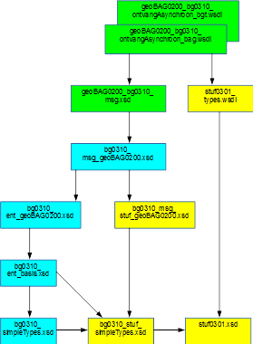

# Bijlage 4: Ontwerpbeslissingen en keuzes verStUFfing 

Het koppelvlak geoBAG is gedefinieerd met een eigen berichtenset en een eigen namespace. 

De entiteittypen LIG, STA en VBO zijn gedefinieerd als restrictions op het complexType TGOAOT-basis. Dit mag, omdat het supertype TGOAOT is gedefinieerd in bg0310. Binnen het sectormodel WOZ is dit ook zo gedaan. 

Binnen het element adresAanduidingGrp zijn uitsluitend de namen opgenomen van de woonplaats en de openbare ruimte en niet ook hun identificaties. Alle elementen zijn verplicht, ook aoa.woonplaatsWaarinGelegen/wpl.woonplaatsnaam. Indien het object ligt in de woonplaats aangeduid door wpl.woonplaatsnaam, dan dient in aoa.woonplaatsWaarinGelegen/wpl.woonplaatsnaam dezelfde waarde te worden opgenomen als in wpl.woonplaatsnaam, zo niet dan wordt woonplaats opgenomen waarin het adresseerbaar object feitelijk ligt. 

De objectkennisgevingen in hoofdstuk 5 van het functionele ontwerp zijn niet geïmplementeerd als kennisgevingen maar als elementen met StUF:functie=”entiteit” binnen de vrije berichten gmvDi01 en gmlDi01. Hiervoor is gekozen, omdat in het geometrieverzoek de semantiek is het identificeren van het object waarvoor de geometrie wordt gevraagd. In de geometrielevering worden alleen de nieuwe waarden geleverd en dat kan niet met de semantiek van een StUF-kennisgeving. Het element StUF:indicatorOvername is hierdoor vervallen, maar dit is niet erg, omdat het functioneel ontwerp specificeert hoe het bericht verwerkt moet worden. 

Er is gekozen voor een strakkere definitie van de functionaliteit in vrije berichten. Hierdoor zijn ook de bevestigings- en foutberichten goed te valideren. In de parameters van deze berichten is de functionele identificatie van het bericht waarop wordt gereageerd opgenomen. In geval van een fout zijn in de parameters ook de elementen met de omschrijving van de fout opgenomen. De sleutels van de objecten waarop de respons betrekking heeft, zijn opgenomen als de entiteiten LIG, PND, STA, VBO en WPL met als enig element identificatie en met de attributes sleutelVerzendend en sleutelOntvangend. Het is hiermee mogelijk om een deel van de objecten goed te keuren en een ander deel af te keuren met desgewenst verschillende redenen voor de afkeuring. 

## Afhankelijkheden schema's en wsdl's 
 
De hiernaast staande figuur geeft de afhankelijkheden voor de wsdl's van het StUF-geoBAG0100-koppelvlak van andere schema's in wsdl's. Bovenaan staan in de groene blokken voor de geoBAG0100 namespace de twee wsdl's voor het StUF-geoBAG0100-koppelvlak. 

Deze twee wsdl's hangen af van een schema met de berichten voor het koppelvlak en van de wsdl voor stuf0301 in het gele blok, die zelf weer afhankelijk is van het stuf0301 schema.  

Het koppelvlak is gedefinieerd in een eigen namespace, maar deze namespace wordt alleen toegepast in de berichtelementen op het hoogste niveau. De verdere inhoud van de berichten is gedefinieerd in de bg0310 namespace (blauwe blokken). Het schema met berichtelementen in de geoBAG0100 namespace is daarom afhankelijk van een blauw schema met complexTypes voor de berichtelementen. 

Dit schema is op zijn beurt weer afhankelijk van: 
* een schema met de specifiek in het StUF-geoBAG0100 koppelvlak gebruikte complexTypes voor de BAG-entiteittypen in bg0310 en de parameters-elementen in vrije berichten. 
* een schema in de stuf0301 namespace met de definities van de stuurgegevens elementen. 

De rest van de pijlen laten de gebruikelijke afhankelijkheden van de schema's onderin de boom van afhankelijkheden zien. 
