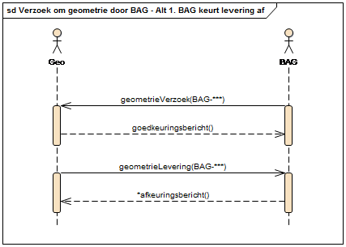
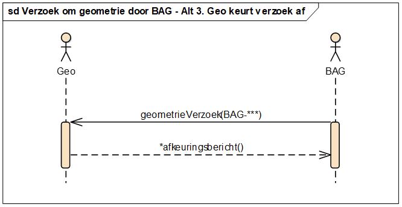
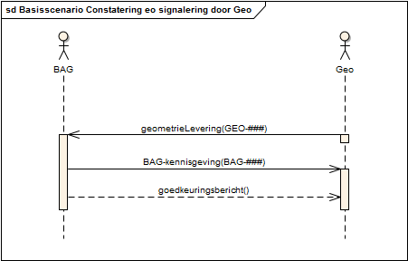
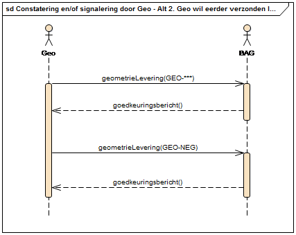
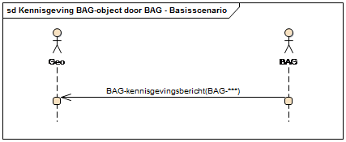

# Scenario’s 
Dit hoofdstuk beschrijft drie algemene scenario’s waarvoor StUF-Geo BAG berichtenverkeer toegepast wordt, t.w. verzoek om geometrie door BAG (3.1), constatering en signalering door Geo (3.2), en kennisgeving op object door BAG (3.3). 

Onderstaand figuur toont een overzicht van de samenhang tussen de verschillende scenario’s (use cases) en de initiërende actor (Geo of BAG) in het StUF-Geo BAG berichtenverkeer. Een volledig overzicht van de samenhang van activiteiten in de scenario’s van het StUF-Geo BAG berichtenverkeer is opgenomen in Bijlage 2. 

*Figuur 3.1 Use case diagram van het StUF-Geo BAG berichtenverkeer*

## Verzoek om geometrie door BAG 

### Basisscenario 
Op enig moment doet BAG naar aanleiding van een BAG-gebeurtenis (BAG-###) een verzoek aan Geo voor het leveren van geometrie in een geometrieVerzoek. Dit verzoek betreft een wens tot aanlevering van geometrie voor een bepaald object n.a.v. een bepaalde gebeurtenis. 

Op het moment dat Geo het verzoek in behandeling neemt, stuurt Geo een goedkeuringsbericht aan BAG. Geo gaat op enig moment over tot verwerking van het verzoek, te weten de inwinning en kartering van de geometrie. Op het moment dat Geo de inwinning en kartering van de geometrie voltooid heeft, zal Geo de geometrie uitleveren aan BAG in een geometrieLevering. 

BAG gaat over tot de beoordeling van de geometrieLevering. Indien BAG de geometrie in de geometrieLevering goedkeurt, stuurt BAG een bevestiging van acceptatie/overname van de geometrie aan Geo middels een goedkeuringsbericht. 

Na succesvolle verwerking in de eigen applicatie stuurt BAG de actuele stand van het BAG-object middels een BAG-kennisgeving aan Geo[^25]. Geo verwerkt de gegevens in de BAG-kennisgeving in de eigen applicatie. 

*Figuur 3.2 Sequentiediagram Verzoek om geometrie door BAG – Basisscenario[^26][^27]*

[^25] En ook naar andere afnemers in de organisatie. 

[^26] ### is jokerteken voor gebeurteniscode. BAG-### betekent elke gebeurtenis die ontstaat bij BAG. 

[^27] xxxLk03 betekent voor elke BAG-kennisgeving zijnde een Lk03-bericht. 

### Alternatief scenario: BAG keurt levering af 
Indien BAG de gegegevens in een geometrieLevering afkeurt, stuurt BAG de reden van afkeuring aan Geo in één of meer afkeuringsberichten. Indien BAG een gecorrigeerde (geometrie)levering voor dit object wenst te ontvangen, stuurt BAG een nieuw geometrieVerzoek aan Geo[^28]. 

*Figuur 3.3 Sequentiediagram Verzoek om geometrie door BAG – Alt 1. BAG keurt levering af.*

[^28] De gevolgen voor de BGT worden beoordeeld door de BGT operator. Hiermee is de afhandeling van het geometrieVerzoek 
voor Geo afgerond. 

### Alternatief scenario: BAG wil eerder verzonden geometrieVerzoek intrekken 
Indien BAG een eerder verzonden geometrieVerzoek wil intrekken (bijv. indien een vergunning niet wordt verleend, terwijl de aanvraag voor geometrie al was uitgezet door BAG), stuurt BAG een nieuw geometrieVerzoek met gebeurtenis ‘Negeren eerder verzonden geometrieVerzoek’ (BAG-NEG) naar Geo. 

Indien Geo het eerder verzonden geometrieVerzoek nog niet heeft afgehandeld[^29], kan het dit geometrieVerzoek negeren. Geo stuurt een bevestiging dat het geometrieVerzoek wordt genegeerd in een goedkeuringsbericht aan BAG. 

*Figuur 3.4 Sequentiediagram Verzoek om geometrie door BAG – Alt 2. BAG wil eerder verzoek intrekken*

[^29] D.w.z. dat een geometrieLevering is teruggestuurd

### Alternatief scenario: Geo keurt geometrieVerzoek af 
Indien Geo een geometrieVerzoek van BAG niet kan verwerken (bijv. BAG-geometrie van object is recent al uitgeleverd), keurt Geo het geometrieVerzoek af. Geo stuurt de reden van afkeuring aan BAG in één of meer afkeuringsberichten[^30]. 

[^30] De gevolgen voor de BGT worden beoordeeld door de BGT operator. Geo kan op eigen initiatief en met de kennis van de 
reden van afkeuring opnieuw een geometrieLevering doen aan BAG. 

*Figuur 3.5 Sequentiediagram Verzoek om geometrie door BAG – Alt 3. Geo keurt verzoek af*

## Constatering en/of signalering door Geo

### Basisscenario 
Op enig moment heeft Geo naar aanleiding van een Geo-gebeurtenis (Geo-###) nieuwe objecten geconstateerd en/of wijzigingen op bestaande BAG-objecten gesignaleerd (bijv. na het signaleren van mutaties van BAG-objecten in luchtfoto’s). Geo stelt voor ieder gewijzigd of nieuw object een bericht geometrieLevering op en stuurt deze aan BAG. Aan de gebeurteniscode kan BAG afleiden dat het een levering betreft naar aanleiding van een constatering of (mutatie)signalering. 

BAG gaat over tot de beoordeling van de geometrieLevering. Indien BAG een geconstateerd object in de geometrieLevering goedkeurt, voert BAG een nieuw object op in de eigen registratie. Na succesvolle verwerking in de eigen applicatie stuurt BAG de actuele stand van het BAG-object middels een BAG-kennisgeving aan Geo[^32]. Geo verwerkt de gegevens in de BAG-kennisgeving in de eigen applicatie. 

Gelijktijdig of na het versturen van de BAG-kennisgeving stuurt BAG, stuurt BAG een bevestiging van acceptatie/overname van de geometrie aan Geo middels een goedkeuringsbericht. In dit goedkeuringsbericht wordt voor elk goedgekeurd geconstateerd object de BAG-identificatie en de technische sleutel van Geo opgenomen.

*Figuur 3.6 Sequentiediagram Constatering en/of signalering door Geo – Basisscenario*

[^32] En ook naar andere afnemers in de organisatie.

### Alternatief scenario: BAG keurt geometrie af 
Indien BAG de gegevens in een geometrieLevering afkeurt, stuurt BAG de reden van afkeuring aan Geo in 
een afkeuringsbericht[^33]. Eventueel met de reden of toelichting in het vrije tekstveld van “Details”. 

Indien nodig, stuurt Geo een nieuwe Geometrielevering. 

*Figuur 3.7 Sequentiediagram Constatering en/of signalering door Geo – Alt 1. BAG keurt levering af*

[^33] De gevolgen voor de BGT worden beoordeeld door de BGT operator. Geo kan op eigen initiatief en met de kennis van de 
reden van afkeuring opnieuw een geometrieLevering doen aan BAG. 

### Alternatief scenario: Geo wil eerder verzonden geometrieLevering intrekken 
Indien Geo een eerder verzonden geometrieLevering wil intrekken (bijv. na kwaliteitscontrole door Geo blijkt een object niet juist geclassificeerd en relevant voor BAG), stuurt Geo een nieuwe geometrieLevering met gebeurtenis ‘Negeren eerder verzonden geometrieLevering’ (GEO-NEG) naar BAG. 

Indien BAG de eerder verzonden geometrieLevering nog niet heeft verwerkt, kan het deze geometrieLevering negeren. Indien BAG de eerder verzonden geometrieLevering wel heeft verwerkt, volgt een afkeuringsbericht met reden van afkeuring aan Geo conform §3.2.2. 

*Figuur 3.8 Sequentiediagram Verzoek om geometrie door BAG – Alt. 2 Geo wil eerder verzoek intrekken*

## Kennisgeving op object door BAG 
Op enig moment heeft BAG naar aanleiding van een BAG-gebeurtenis (BAG-###) mutaties zijnde toevoeging, wijziging of beëindiging op één of meer BAG-objecten in de eigen applicatie, waarvan Geo op de hoogte gesteld moet worden. BAG stelt hiertoe voor iedere mutatie een apart BAG-kennisgevingsbericht samen en stuurt deze aan Geo[^34]. Geo verwerkt wat ze nodig hebben aan gegevens in de eigen applicatie. Geo verstuurd geen functionele respons na succesvolle verwerking van de BAG-kennisgeving in de eigen applicatie. 

*Figuur 3.9 Sequentiediagram Kennisgeving op object door BAG*

[^34] En ook naar andere afnemers in de organisatie. 
